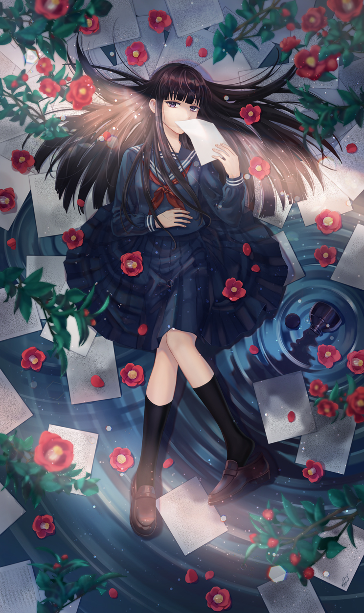
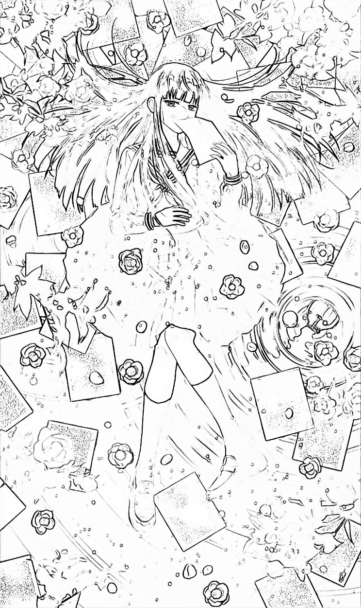
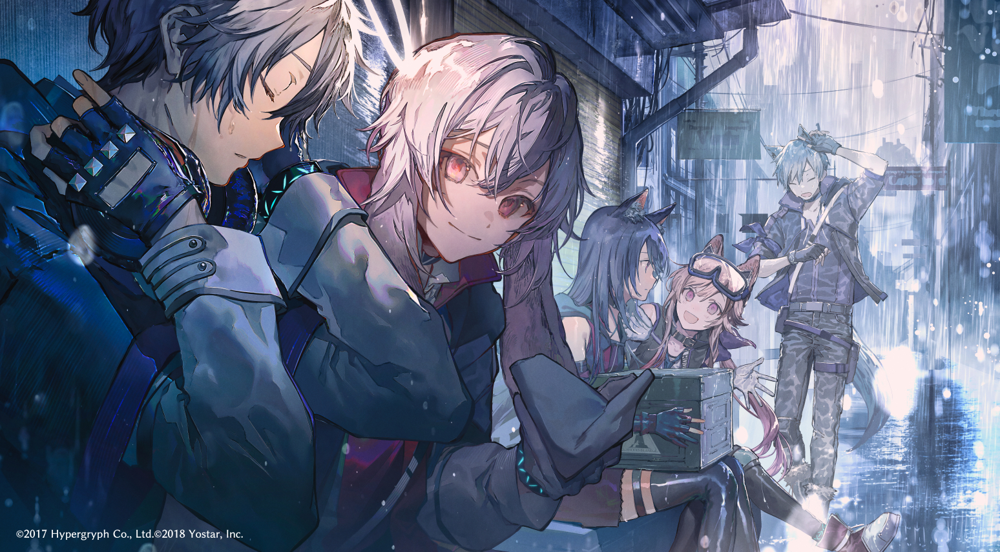
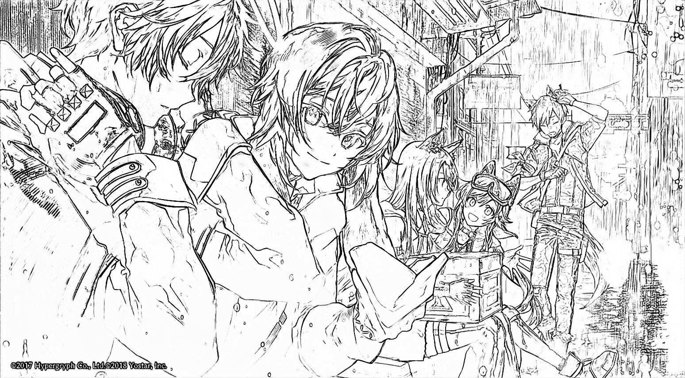
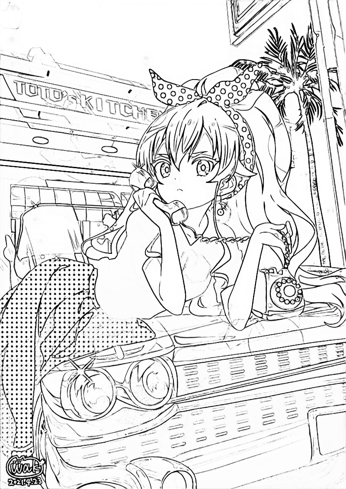

# Illustration2LineDrawing
Convert illustrations to line drawings

model: [model.pth](https://drive.google.com/file/d/1-aa9Svl8uAqJ4extZh8w-z4VeCIvmKyp/view?usp=sharing)

Put your paintings in "/testing_inputs" and run testing.py. The results will be in "/testing_outpus".

|        Input illustration(イラスト)         |       Output line drawing(線画)         |
|:-----------------------------:|:------------------------------:|
|  |  |
|  |  |
|  |  |

### Requirement

  + python3
  + pytorch
  + opencv-python

## Reference
- [MangaLineExtraction_PyTorch](https://github.com/ljsabc/MangaLineExtraction_PyTorch)
